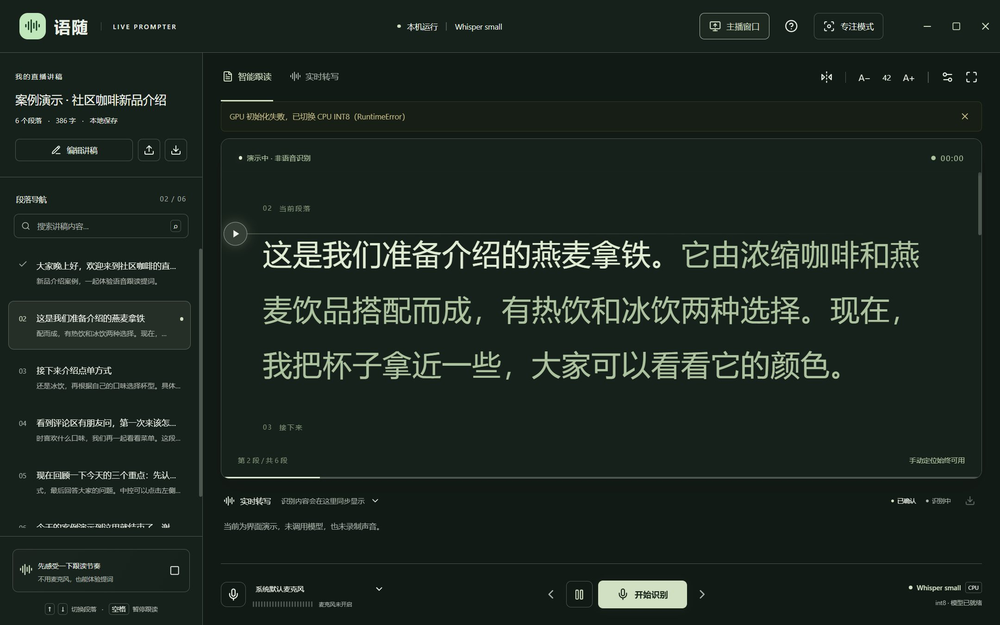
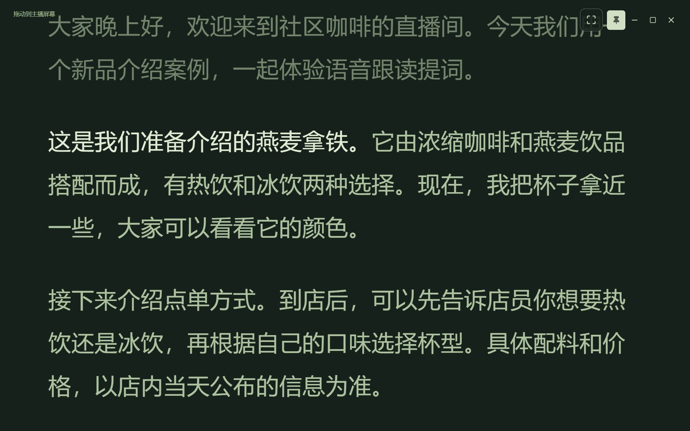
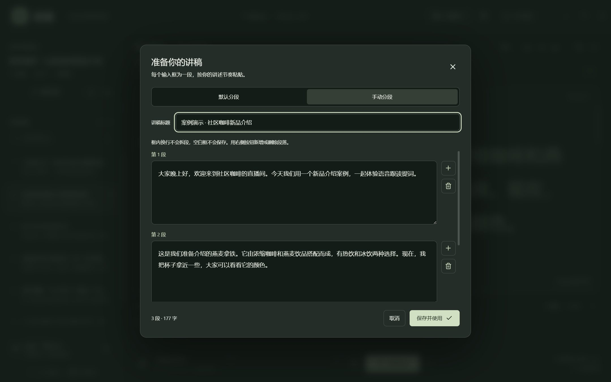
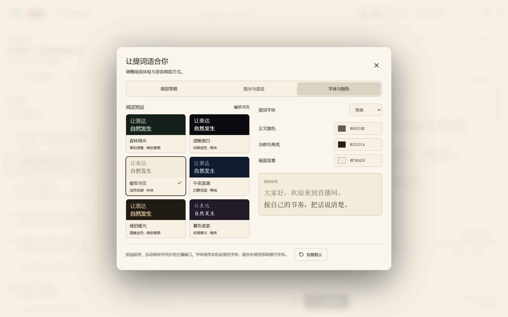
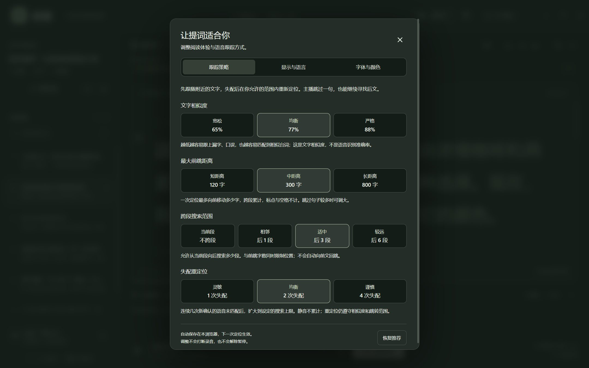
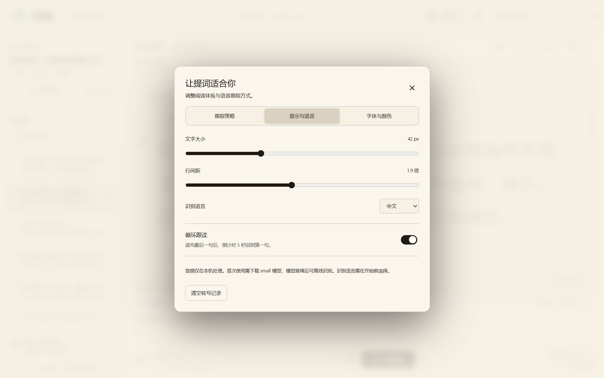
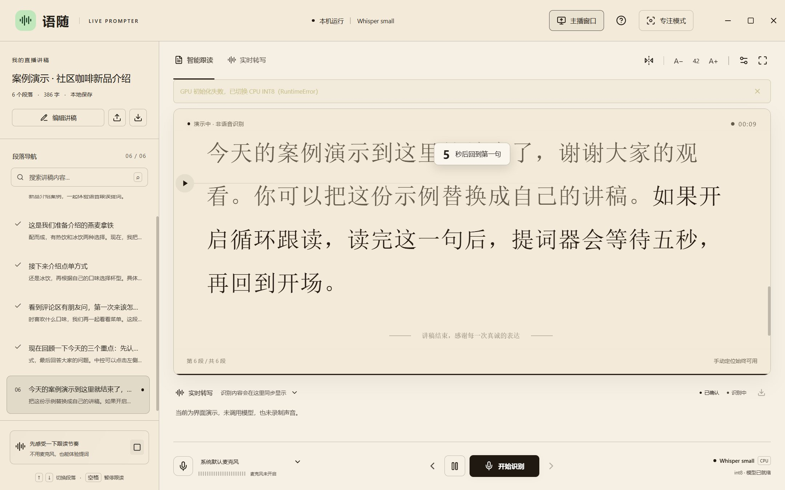

# 语随 · Whisper small 直播提词器

面向 Windows 直播场景的本地提词器。使用 **faster-whisper + Whisper small 多语言模型**识别麦克风语音，与讲稿匹配后高亮并滚动。提供无边框中控客户端和独立主播窗口，音频仅发送至本机回环地址，不上传到外部服务、不保存录音。

## 功能

- **双屏提词**：中控选择章节，主播窗口只显示正文，可拖到另一个屏幕并开启置顶。
- **智能跟读**：按语音推进；可调整文字相似度、最大前跳距离、跨段搜索范围及失配重定位档位。
- **手动定位**：点击章节或使用方向键跳段；将句子滚动到横线处，点击三角按钮从该句重新跟读。
- **独立浏览**：中控滚轮查看上下文时，识别与主播跟读继续；点击“回到跟读位置”恢复中控画面。
- **讲稿编辑**：默认按空行分段，也可每个输入框手动设置一个段落；支持 TXT / Markdown 导入和 TXT 导出。
- **字体与主题**：六套预设、自定义字体和颜色，覆盖整个客户端及主播窗口；支持字号、行距、镜像和全屏。
- **循环跟读**：在“提词设置 → 显示与语言”开启，读完最后一句后倒计时五秒回到第一句。暂停、手动跳段、停止识别或关闭开关会取消倒计时。
- **无稿转写**：实时转写模式自动滚动到新文字，可导出当前会话记录。

首次启动使用虚构的“社区咖啡新品介绍”案例，纯文本见 [examples/demo-script.txt](examples/demo-script.txt)。保存自己的讲稿后，程序保留用户内容，不会再次覆盖为示例。

## 功能截图

以下截图来自 Windows 客户端，使用虚构案例讲稿。跟读与循环画面使用内置演示，未开启真实麦克风。七张 JPEG 图片合计约 1.1 MB。

### 中控与句子定位

左侧选择段落，正文高亮当前句子。浏览上下文后，点击横线左侧的三角按钮，可以从横线处的句子继续跟读。



### 独立主播窗口

主播窗口以正文为主，可拖到另一块屏幕。右上角图钉开启置顶，中控仍可浏览和选择章节。



### 手动分段

在“编辑讲稿”切换到“手动分段”，每个输入框作为一个段落，右侧按钮新增或删除段落。



### 字体与主题

六套阅读预设支持一键切换，也可自定义字体、正文颜色、高亮色和背景色。主题覆盖整个客户端，并同步到主播窗口。



<details>
<summary>查看更多：跟踪策略与循环跟读</summary>

### 跟踪策略

按档位调整匹配相似度、最大前跳距离、跨段搜索范围和失配重定位，适应不同朗读习惯。



### 循环设置

在“显示与语言”开启“循环跟读”，读完最后一句后等待五秒，再回到第一句。



### 五秒倒计时

讲稿读完后，正文上方显示返回第一句的倒计时。此图展示内置演示中的循环状态。



</details>

## 安装与启动

### 直接下载 Windows 客户端（推荐）

下载 [最新版 Windows 客户端 ZIP](https://github.com/s2901457171-arch/yusui-prompter/releases/latest/download/Yusui-win-x64.zip)，完整解压到有写入权限的文件夹，双击 **`启动语随.cmd`**。需要 Windows 10/11 64 位，无需手动安装 Node.js 或 Python，也不需要编译。

首次启动自动下载独立 Python 运行环境、Python 识别依赖和 Whisper small 模型，需要联网；下载完成后使用本地缓存。运行环境下载会校验 SHA-256。不要单独移走 EXE，也不要在 ZIP 内直接运行程序。

### 从源码安装

需要 **Windows 10/11 64 位和 Node.js 22.12+（含 npm）**。Python 运行环境由应用下载，不要求事先安装到系统。安装 Node.js 后重新打开终端。

1. 克隆仓库，或用 GitHub 的 **Code → Download ZIP** 下载并完整解压。
2. 双击 `安装并启动.cmd`。脚本通过 npm 下载前端依赖和 Electron，编译界面、生成程序图标，再构建本地客户端。
3. 客户端首次启动会下载独立 Python 运行环境，通过 pip 下载识别依赖，并下载 Whisper small 模型。等待右下角显示“模型已就绪”。首次安装和模型下载需要网络。
4. 之后双击 `启动新版.cmd`，或安装时生成的“语随提词器”快捷方式。无需再次执行安装脚本，也无需打开浏览器。

也可以在 PowerShell 中安装：

```powershell
powershell.exe -NoProfile -ExecutionPolicy Bypass -File .\setup.ps1
```

默认使用可用的 NVIDIA GPU（CUDA FP16），否则使用 CPU INT8。需要 GPU 库时，先完成首次启动，再关闭客户端并运行 `enable-gpu.cmd`，通过 pip 下载可选的 NVIDIA cuBLAS / cuDNN 运行库；随后重新启动。GPU 驱动由用户安装，CPU 模式无需这些可选库。

软件会自动缓存模型到 `data/models/`，以后可读取本地缓存。已有 **CTranslate2 格式的多语言 small 模型**时，可设置 `WHISPER_MODEL_PATH` 指向该模型目录。

如果 npm 安装成功但 Electron 下载失败，请检查是否可以访问 GitHub 的发行文件。下载器也支持用 `ELECTRON_MIRROR` 指定自己信任的 Electron 镜像；保留默认的校验和检查，不需要把运行时提交到仓库。

## 使用

1. 点击“编辑讲稿”，粘贴自己的内容并选择分段方式，再保存。
2. 选择麦克风并点击“开始识别”；遇到权限提示时，在 Windows 麦克风隐私设置中允许桌面应用访问。
3. 从当前段落朗读，或使用“体验跟读”按钮在不开麦克风的情况下演示。
4. 点击“主播窗口”，拖动到主播显示器；右上角图钉切换置顶，鼠标移入显示窗口按钮。

快捷键：**↑ / ↓** 切换段落，**空格**暂停或恢复跟读。自动匹配只向后文推进，回到前文请手动定位。循环只用于有稿跟读，实时转写模式不循环。

## 下载内容与本地数据

仓库仅包含源码、测试、示例、安装脚本和功能截图，**不包含** `node_modules/`、`client/`、`dist/`、Python 环境、Whisper 模型、GPU 库、用户讲稿、浏览器数据、日志或录音。程序图标也由源码构建时生成。

| 目录 | 内容 | 获取方式 |
| --- | --- | --- |
| `node_modules/` | 前端依赖、Electron 下载包 | `npm ci` |
| `dist/` | 编译后的界面 | `npm run build` |
| `client/` | 本地生成的 Windows 客户端 | `npm run build:desktop` |
| `data/runtime/` | 独立 Python 环境及识别依赖 | 首次启动从 Release 下载运行环境，再通过 pip 安装依赖 |
| `data/models/` | Whisper small 模型缓存 | 首次加载自动下载 |
| `data/desktop-profile/` | 用户讲稿、设置与窗口位置 | 使用时本地生成 |

请保留完整应用目录，单独复制一个 EXE 无法运行。可整体移动目录，移动后运行 `启动新版.cmd` 重新生成快捷方式。重要讲稿请导出备份；不要删除 `data/desktop-profile/`。转写记录只保留当前会话，退出前请导出。

## 开发与测试

```powershell
npm ci
npm run build
npm run build:desktop
npm test
```

单独准备识别环境和启动本地服务：

```powershell
powershell.exe -NoProfile -ExecutionPolicy Bypass -File .\start.ps1 -NoBrowser
.\data\runtime\Scripts\python.exe -m unittest discover -s tests -v
```

开发界面：`npm run dev`；Vite 代理到本机 8765 端口。浏览器回归测试需要 Edge 和运行中的服务：`npm run test:e2e`。桌面回归测试需先构建客户端：`npm run test:desktop`，使用隔离的 8766 端口和 `data/desktop-test-profile/`。设置 `TEST_AUDIO_PATH` 为本地 WAV 文件可运行可选的虚拟麦克风实际识别测试，不打开真实麦克风。

发布时的独立 Python 资产由 `scripts/build-runtime.py --output <目录>` 使用构建机的 Windows Python 生成，包含 Python 许可证和 ensurepip，排除识别依赖、模型及个人数据。该脚本更新 `desktop/runtime-download.json` 中的版本地址和 SHA-256；运行时资产与客户端一起上传到对应版本的 Release。源码仓库继续保持精简。

主要源码：`src/App.tsx`（中控）、`src/Presenter.tsx`（主播窗口）、`desktop/main.cjs`（桌面外壳）、`server/recognizer.py`（模型推理）、`server/core.py`（文字稳定与匹配）、`tracking-options.json`（策略档位）。

## 识别边界

跟读基于局部文字相似度，不理解大幅改写的语义。重复台词、漏读、噪声、方言或背景人声可能使定位不确定；可调整策略或手动跳转。手动定位与循环会建立新的识别版本，丢弃旧位置的未完成结果。正式直播前，请使用自己的麦克风和实际直播负载试读。CPU 上的推理速度取决于设备性能。

## 技术来源

- [OpenAI Whisper](https://github.com/openai/whisper)
- [faster-whisper](https://github.com/SYSTRAN/faster-whisper)
- [Electron](https://www.electronjs.org/)
- [React](https://react.dev/)
- [Lucide](https://lucide.dev/)

第三方依赖与模型遵循各自的许可证。
